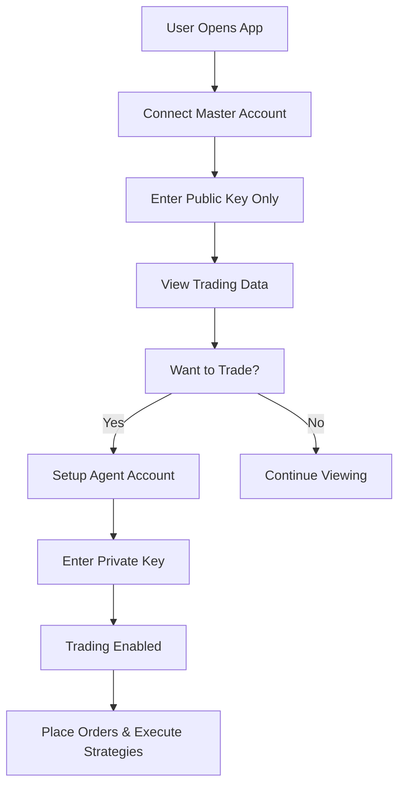
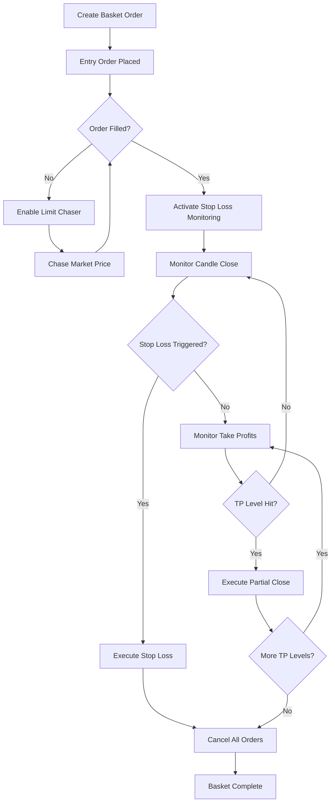

# 🚀 HyperLiquid Trading System - Comprehensive Documentation Guide

## 📋 Table of Contents
1. [System Overview](#system-overview)
2. [Architecture & Components](#architecture--components)
3. [Master/Agent Account System](#masteragent-account-system)
4. [Basket Order Trading System](#basket-order-trading-system)
5. [Trading Features](#trading-features)
6. [Technical Implementation](#technical-implementation)
7. [User Interface Guide](#user-interface-guide)
8. [API Integration](#api-integration)
9. [Security & Risk Management](#security--risk-management)
10. [Testing & Validation](#testing--validation)
11. [Deployment Guide](#deployment-guide)
12. [Troubleshooting](#troubleshooting)

---

## 🎯 System Overview

### What is the HyperLiquid Trading System?

The **HyperLiquid Trading System** is a sophisticated desktop application built with **Electron + React** that provides advanced trading capabilities for the HyperLiquid decentralized exchange. It combines professional trading tools with an intuitive interface, offering both manual and automated trading strategies.

### Key Features
- 🔐 **Dual Account System**: Master (view-only) and Agent (trading) accounts
- 🤖 **Advanced Basket Orders**: Automated multi-component trading strategies
- 📊 **Real-time Market Data**: Live price feeds and market monitoring
- 🎯 **Smart Order Execution**: Limit chasers, stop losses, and take profits
- 🛡️ **Risk Management**: Built-in safety mechanisms and position controls
- 📱 **User-Friendly Interface**: Intuitive desktop application

### Technology Stack
```
Frontend:  React + TypeScript + Tailwind CSS
Desktop:   Electron (Cross-platform compatibility)
Trading:   HyperLiquid API Integration
Signing:   EIP-712 Cryptographic Signatures
Data:      Real-time WebSocket + REST API
```

---

## 🏗️ Architecture & Components

### System Architecture

```
┌─────────────────────────────────────────────────────────────┐
│                    HyperLiquid Trading App                  │
├─────────────────────────────────────────────────────────────┤
│  Frontend (React + TypeScript)                             │
│  ├── Navbar (Account Status)                               │
│  ├── Graph (Market Data Visualization)                     │
│  ├── Tabs (Balances, Positions, Orders, History)          │
│  └── Trading Controls (Order Placement, Basket Orders)    │
├─────────────────────────────────────────────────────────────┤
│  Context Providers                                         │
│  ├── TradingContext (Master Account + Market Data)         │
│  └── MultiAccountTradingContext (Agent Accounts)           │
├─────────────────────────────────────────────────────────────┤
│  Core Services                                             │
│  ├── Market Data Service (Price feeds, Candle data)        │
│  ├── Basket Order Manager (Automated strategies)           │
│  ├── Trading API (Order execution)                         │
│  └── Signing Service (EIP-712 signatures)                  │
├─────────────────────────────────────────────────────────────┤
│  HyperLiquid API                                           │
│  ├── REST API (Account data, Order management)             │
│  └── WebSocket (Real-time price feeds)                     │
└─────────────────────────────────────────────────────────────┘
```

### Core Components

#### 1. **Application Core** (`src/App.tsx`)
- Main application wrapper
- State management for UI controls
- Modal and sidebar management
- Provider composition

#### 2. **Trading Context** (`src/contexts/TradingContext.tsx`)
- Master account management (view-only)
- Market data integration
- Order preparation and validation
- Real-time price updates

#### 3. **Multi-Account Context** (`src/contexts/MultiAccountTradingContext.tsx`)
- Agent account management (trading-enabled)
- Multiple wallet support
- Trading execution coordination

#### 4. **Market Data Service** (`src/utils/marketDataService.ts`)
- HyperLiquid API integration
- Real-time price feeds
- Account data fetching
- Trade history management

#### 5. **Basket Order Manager** (`src/utils/basketOrderManager.ts`)
- Advanced trading strategy execution
- Automated order management
- Risk control and monitoring
- Multi-timeframe candle monitoring

---

## 🔐 Master/Agent Account System

### Account Architecture

The system implements a **dual-account security model** that separates viewing capabilities from trading operations:

#### 🔍 Master Account (View-Only)
**Purpose**: Display trading data and monitor account status
```typescript
interface ConnectedAccount {
  accountId: number;
  accountName: string;
  publicKey: string;        // ✅ Only public key required
  privateKey: "";           // ❌ Empty - no private key
  balance: string;
  pnl: string;
  connectionStatus: "connected" | "idle" | "error";
}
```

**Capabilities**:
- ✅ View balances and PnL
- ✅ Monitor open positions
- ✅ Check order status
- ✅ Review trade history
- ❌ **Cannot place orders**
- ❌ **Cannot modify positions**

#### ⚡ Agent Account (Trading-Enabled)
**Purpose**: Execute trades and manage positions
```typescript
interface AgentAccount {
  accountId: number;
  accountName: string;
  publicKey: string;
  privateKey: string;       // ✅ Private key required for signing
  isActive: boolean;
  connectionStatus: "connected" | "idle" | "error";
}
```

**Capabilities**:
- ✅ Place market/limit orders
- ✅ Create basket orders
- ✅ Modify/cancel orders
- ✅ Manage positions
- ✅ Execute automated strategies

### Security Benefits

1. **Separation of Concerns**: Viewing data doesn't require exposing private keys
2. **Reduced Risk**: Master account cannot accidentally execute trades
3. **Granular Control**: Different accounts for different purposes
4. **Audit Trail**: Clear distinction between viewing and trading actions

### Connection Flow



---

## 🎯 Basket Order Trading System

### What are Basket Orders?

**Basket Orders** are sophisticated, automated trading strategies that combine multiple order types into a single, coordinated execution plan. They automate complex trading workflows that would normally require constant manual monitoring.

### Core Components

#### 1. **Entry Order**
- Market or limit order to enter the position
- Configurable quantity, price, and leverage
- Automatic execution when conditions are met

#### 2. **Stop Loss with Candle Confirmation**
- Trigger-based stop loss that waits for candle close
- Prevents false triggers from price wicks
- Configurable timeframes (1m, 5m, 15m, 1h, 4h, 1d)
- Market or limit order execution

#### 3. **Limit Chaser**
- Dynamically follows market price at a set distance
- Reduces slippage by staying close to market
- Fill-or-Cancel (IOC) behavior for immediate execution
- Maximum chase limits to prevent runaway orders

#### 4. **Take Profit Levels**
- Multiple profit-taking levels
- Partial position closing at each level
- Percentage-based quantity allocation

### Basket Order Configuration

```typescript
interface BasketOrderConfig {
  id: string;
  name: string;
  symbol: string;
  side: 'buy' | 'sell';
  
  // Entry order configuration
  entryOrder: {
    type: 'market' | 'limit';
    quantity: number;
    price: number;
    leverage: number;
  };
  
  // Stop loss with candle confirmation
  stopLoss: {
    enabled: boolean;
    triggerPrice: number;
    orderType: 'market' | 'limit';
    timeframe: '1m' | '5m' | '15m' | '1h' | '4h' | '1d';
    candleCloseConfirmation: boolean;
  };
  
  // Intelligent limit chaser
  limitChaser: {
    enabled: boolean;
    distance: number;                    // Distance from market price
    distanceType: 'percentage' | 'absolute';
    fillOrCancel: boolean;               // IOC behavior
    updateInterval: number;              // Update frequency (seconds)
    maxChases: number;                   // Maximum chase attempts
  };
  
  // Multiple take profit levels
  takeProfits: TakeProfitConfig[];
  
  status: 'pending' | 'active' | 'completed' | 'cancelled';
  activeOrders: ActiveOrderIds;
  executionLog: ExecutionLogEntry[];
}
```

### Real-World Example: BTC Breakout Strategy

```javascript
const btcBreakoutBasket = {
  name: 'BTC Long with Smart Exit',
  symbol: 'BTC',
  side: 'buy',
  
  // Entry: Limit buy below current market
  entryOrder: {
    type: 'limit',
    quantity: 0.001,
    price: 94500,      // Entry at $94.5k
    leverage: 10
  },
  
  // Stop Loss: Trigger on 15m candle close below $90k
  stopLoss: {
    enabled: true,
    triggerPrice: 90000,
    orderType: 'market',
    timeframe: '15m',
    candleCloseConfirmation: true
  },
  
  // Limit Chaser: Follow market at 1% distance
  limitChaser: {
    enabled: true,
    distance: 0.01,           // 1% below market
    distanceType: 'percentage',
    fillOrCancel: true,       // IOC orders
    updateInterval: 30,       // Update every 30 seconds
    maxChases: 10            // Maximum 10 price updates
  },
  
  // Take Profits: Multiple exit levels
  takeProfits: [
    {
      targetPrice: 100000,    // First TP at $100k
      quantity: 50,           // 50% of position
      orderType: 'limit'
    },
    {
      targetPrice: 105000,    // Second TP at $105k
      quantity: 50,           // Remaining 50%
      orderType: 'limit'
    }
  ]
};
```

### Execution Flow



---

## 💹 Trading Features

### 1. **Manual Trading**

#### Order Types
- **Market Orders**: Immediate execution at current market price
- **Limit Orders**: Execute at specific price or better
- **Conditional Orders**: Trigger-based order execution

#### Order Management
- Real-time order book monitoring
- Instant order cancellation
- Position modification
- Leverage adjustment

### 2. **Advanced Order Features**

#### Order Splitting
- Divide large orders into smaller chunks
- Reduce market impact
- Configurable split parameters

#### Stop Loss Orders
- Market or limit stop losses
- Trailing stop losses
- Conditional triggers

#### Take Profit Orders
- Single or multiple profit levels
- Partial position closing
- Automatic execution

### 3. **Automated Strategies**

#### Limit Chasing
- Dynamic price following
- Configurable distance parameters
- Maximum chase limits
- IOC order behavior

#### Conditional Execution
- Time-based triggers
- Price-based triggers
- Volume-based triggers
- Custom conditions

### 4. **Risk Management**

#### Position Limits
- Maximum position size controls
- Leverage restrictions
- Account-based limits

#### Stop Loss Management
- Mandatory stop losses for baskets
- Candle close confirmation
- Multiple timeframe support

#### Order Validation
- Pre-execution checks
- Balance verification
- Risk parameter validation

---

## 🛠️ Technical Implementation

### Core Technologies

#### Frontend Stack
```json
{
  "framework": "React 18 + TypeScript",
  "styling": "Tailwind CSS",
  "icons": "FontAwesome",
  "desktop": "Electron",
  "bundler": "Vite"
}
```

#### Key Dependencies
```json
{
  "dependencies": {
    "react": "^18.0.0",
    "typescript": "^5.0.0",
    "tailwindcss": "^3.0.0",
    "electron": "^latest",
    "ethers": "^6.0.0",
    "msgpack-lite": "^0.1.26"
  }
}
```

### API Integration

#### HyperLiquid API Endpoints
```typescript
const API_ENDPOINTS = {
  INFO: 'https://api.hyperliquid.xyz/info',
  EXCHANGE: 'https://api.hyperliquid.xyz/exchange',
  WEBSOCKET: 'wss://api.hyperliquid.xyz/ws'
};
```

#### Market Data Integration
```typescript
class MarketDataService {
  // Fetch account information
  async fetchAccountInfo(address: string): Promise<AccountInfo>;
  
  // Get real-time prices
  async fetchMarketPrices(): Promise<MarketPrice[]>;
  
  // Retrieve open positions
  async fetchPositions(address: string): Promise<Position[]>;
  
  // Get order history
  async fetchOrderHistory(address: string): Promise<TradeHistoryItem[]>;
  
  // Real-time price subscriptions
  subscribeToMarketData(symbols: string[]): WebSocket;
}
```

### Cryptographic Signing

#### EIP-712 Signature Implementation
```typescript
// Order signing using EIP-712 standard
async function signOrderAction(
  action: any,
  privateKey: string,
  vaultAddress?: string
): Promise<Signature> {
  const wallet = new ethers.Wallet(privateKey);
  
  const domain = {
    name: 'HyperLiquid',
    version: '1',
    chainId: 421614,
    verifyingContract: '0x0000000000000000000000000000000000000000'
  };
  
  const types = {
    Agent: [
      { name: 'source', type: 'string' },
      { name: 'connectionId', type: 'bytes32' }
    ]
  };
  
  return await wallet.signTypedData(domain, types, action);
}
```

### State Management

#### Context Providers
```typescript
// Master account and market data
<TradingProvider>
  // Agent accounts and trading execution
  <MultiAccountTradingProvider>
    <App />
  </MultiAccountTradingProvider>
</TradingProvider>
```

#### Trading Context Structure
```typescript
interface TradingContextType {
  // Master account (view-only)
  connectedAccount: ConnectedAccount | null;
  
  // Market data
  marketPrices: MarketPrice[];
  positions: Position[];
  openOrders: OpenOrder[];
  tradeHistory: TradeHistoryItem[];
  
  // Trading functions
  executeOrder: (order: TradingOrder) => Promise<void>;
  cancelOrder: (orderId: string) => Promise<void>;
  closePosition: (symbol: string) => Promise<void>;
  
  // Data refresh
  refreshAccountData: () => Promise<void>;
  refreshMarketData: () => Promise<void>;
}
```

---

## 🎨 User Interface Guide

### Application Layout

```
┌─────────────────────────────────────────────────────────────┐
│  Navbar: Account Status, Connection Info, Settings         │
├─────────────────────────────────────────┬───────────────────┤
│                                         │                   │
│  Graph: Market Chart & Analysis         │  Trading Controls │
│                                         │                   │
├─────────────────────────────────────────┤  • Manual Orders  │
│                                         │  • Basket Orders  │
│  Tabs: Balances | Positions |          │  • Limit Chaser   │
│        Orders   | History              │  • Settings       │
│                                         │                   │
└─────────────────────────────────────────┴───────────────────┘
```

### Navigation Components

#### 1. **Navbar** (`src/components/Navbar/Navbar.tsx`)
- **Master Account Status**: Shows connection status and account info
- **Balance Display**: Real-time balance and PnL
- **Connection Indicator**: Visual status of API connection
- **Settings Access**: Application configuration

#### 2. **Trading Tabs** (`src/components/Tabs/`)
- **Balances**: Master account balance information
- **Positions**: Current open positions (view-only)
- **Orders**: Open orders list (view-only)
- **History**: Complete trade history

#### 3. **Trading Controls** (`src/components/TradingControls/`)
- **Manual Trading**: Basic order placement
- **Basket Orders**: Advanced strategy configuration
- **Limit Chaser**: Dynamic order management
- **Settings**: Trading preferences

### Basket Order Interface

#### Configuration Panel
```
┌─────────────────────────────────────────────────────────────┐
│  🎯 Basket Order Configuration                              │
├─────────────────────────────────────────────────────────────┤
│  Strategy Name: [BTC Breakout Strategy         ]            │
│  Symbol:       [BTC        ▼] Side: [Buy  ▼]              │
│                                                             │
│  📈 Entry Order                                             │
│  Type:     [Limit ▼]  Quantity: [0.001]                   │
│  Price:    [$94,500]  Leverage: [10x   ]                  │
│                                                             │
│  🛑 Stop Loss                                               │
│  ☑ Enabled    Trigger: [$90,000]                          │
│  Timeframe:   [15m ▼]  Type: [Market ▼]                   │
│  ☑ Candle Close Confirmation                               │
│                                                             │
│  🏃 Limit Chaser                                            │
│  ☑ Enabled    Distance: [1.0%] Max Chases: [10]           │
│  Update:      [30s]    ☑ Fill-or-Cancel                    │
│                                                             │
│  🎯 Take Profit                                             │
│  Level 1: [$100,000] Quantity: [50%]                      │
│  Level 2: [$105,000] Quantity: [50%]                      │
│                                                             │
│  [Create Basket Order]  [Cancel]                           │
└─────────────────────────────────────────────────────────────┘
```

#### Management Panel
```
┌─────────────────────────────────────────────────────────────┐
│  📊 Active Basket Orders                                    │
├─────────────────────────────────────────────────────────────┤
│  🟢 BTC Breakout Strategy                                   │
│      Status: Active | Entry: Filled | SL: Monitoring       │
│      Current: $95,250 | Target: $100,000 | Risk: 5.0%     │
│      [View Log] [Modify] [Cancel]                          │
│                                                             │
│  🟡 ETH Long Position                                       │
│      Status: Chasing | Entry: Pending | Price: $2,450      │
│      Chase: 7/10 | Distance: 1.2% | Last Update: 15s ago   │
│      [View Log] [Modify] [Cancel]                          │
│                                                             │
│  📈 Execution Log                                           │
│  [12:34:56] Entry order placed: BTC $94,500                │
│  [12:35:12] Entry order filled: 0.001 BTC @ $94,485        │
│  [12:35:15] Stop loss activated: Monitor $90,000           │
│  [12:36:00] Limit chaser started: 1% distance              │
│  [12:36:30] Price update: Chase 1/10 @ $95,100             │
└─────────────────────────────────────────────────────────────┘
```

---

## 🔌 API Integration

### HyperLiquid API Overview

The system integrates with HyperLiquid's REST API and WebSocket feeds for comprehensive trading functionality.

#### Authentication
```typescript
// All trading actions require EIP-712 signatures
const signature = await signOrderAction(orderPayload, privateKey);
```

#### Key API Endpoints

##### 1. **Account Information** (`/info`)
```typescript
// Get account balance and basic info
GET /info
Body: {
  "type": "clearinghouseState",
  "user": "0x..." // Public key
}

Response: {
  "assetPositions": [...],
  "marginSummary": {...},
  "time": 1704067200000
}
```

##### 2. **Market Data** (`/info`)
```typescript
// Get current market prices
GET /info
Body: {
  "type": "allMids"
}

Response: {
  "BTC": "45123.45",
  "ETH": "2567.89",
  ...
}
```

##### 3. **Order Placement** (`/exchange`)
```typescript
// Place trading orders
POST /exchange
Body: {
  "action": {
    "type": "order",
    "orders": [{
      "a": 0,           // Asset index
      "b": true,        // Buy/sell
      "p": "45000",     // Price
      "s": "0.001",     // Size
      "r": false,       // Reduce only
      "t": {
        "limit": {
          "tif": "Gtc"  // Time in force
        }
      }
    }]
  },
  "nonce": 1704067200000,
  "signature": {...},
  "vaultAddress": null
}
```

##### 4. **Order Cancellation** (`/exchange`)
```typescript
// Cancel orders
POST /exchange
Body: {
  "action": {
    "type": "cancel",
    "cancels": [{
      "a": 0,           // Asset index
      "o": 123456789    // Order ID
    }]
  },
  "nonce": 1704067200000,
  "signature": {...}
}
```

#### WebSocket Integration

##### Real-time Price Feeds
```typescript
const ws = new WebSocket('wss://api.hyperliquid.xyz/ws');

// Subscribe to price updates
ws.send(JSON.stringify({
  "method": "subscribe",
  "subscription": {
    "type": "allMids"
  }
}));

// Handle incoming data
ws.onmessage = (event) => {
  const data = JSON.parse(event.data);
  if (data.channel === 'allMids') {
    updateMarketPrices(data.data);
  }
};
```

##### Order Book Updates
```typescript
// Subscribe to order book for specific symbols
ws.send(JSON.stringify({
  "method": "subscribe",
  "subscription": {
    "type": "l2Book",
    "coin": "BTC"
  }
}));
```

### Market Data Service Implementation

```typescript
class MarketDataService {
  private baseURL = 'https://api.hyperliquid.xyz';
  
  async fetchAccountInfo(address: string): Promise<AccountInfo> {
    const response = await fetch(`${this.baseURL}/info`, {
      method: 'POST',
      headers: { 'Content-Type': 'application/json' },
      body: JSON.stringify({
        type: 'clearinghouseState',
        user: address
      })
    });
    
    return response.json();
  }
  
  async fetchMarketPrices(): Promise<MarketPrice[]> {
    const response = await fetch(`${this.baseURL}/info`, {
      method: 'POST',
      headers: { 'Content-Type': 'application/json' },
      body: JSON.stringify({ type: 'allMids' })
    });
    
    const data = await response.json();
    return Object.entries(data).map(([symbol, price]) => ({
      symbol,
      price: parseFloat(price as string),
      timestamp: Date.now()
    }));
  }
  
  async placeOrder(orderPayload: any, signature: any): Promise<any> {
    const response = await fetch(`${this.baseURL}/exchange`, {
      method: 'POST',
      headers: { 'Content-Type': 'application/json' },
      body: JSON.stringify({
        action: orderPayload,
        nonce: Date.now(),
        signature,
        vaultAddress: null
      })
    });
    
    return response.json();
  }
}
```

---

## 🛡️ Security & Risk Management

### Security Implementation

#### 1. **Private Key Management**
```typescript
// Secure key storage and handling
class PrivateKeyManager {
  private keys: Map<string, string> = new Map();
  
  // Store encrypted private keys
  storeKey(accountId: string, encryptedKey: string): void {
    this.keys.set(accountId, encryptedKey);
  }
  
  // Retrieve and decrypt for signing
  async getKey(accountId: string, password: string): Promise<string> {
    const encrypted = this.keys.get(accountId);
    return decrypt(encrypted, password);
  }
  
  // Clear keys on logout
  clearKeys(): void {
    this.keys.clear();
  }
}
```

#### 2. **Account Separation**
- **Master Account**: No private key exposure, view-only access
- **Agent Account**: Separate wallet for trading operations
- **Clear Boundaries**: No mixing of account permissions

#### 3. **Transaction Signing**
```typescript
// EIP-712 signature validation
async function validateSignature(
  signature: Signature,
  payload: any,
  address: string
): Promise<boolean> {
  const recovered = ethers.verifyTypedData(domain, types, payload, signature);
  return recovered.toLowerCase() === address.toLowerCase();
}
```

### Risk Management Features

#### 1. **Position Limits**
```typescript
interface RiskParameters {
  maxPositionSize: number;      // Maximum position size per symbol
  maxLeverage: number;          // Maximum allowed leverage
  maxOpenOrders: number;        // Maximum concurrent orders
  dailyLossLimit: number;       // Maximum daily loss threshold
  accountSizeLimit: number;     // Maximum account size for trading
}
```

#### 2. **Order Validation**
```typescript
function validateOrder(order: TradingOrder, account: ConnectedAccount): boolean {
  // Check account balance
  if (order.quantity * order.price > parseFloat(account.balance)) {
    throw new Error('Insufficient balance');
  }
  
  // Validate leverage
  if (order.leverage > MAX_LEVERAGE) {
    throw new Error('Leverage exceeds maximum allowed');
  }
  
  // Check position size
  if (order.quantity > MAX_POSITION_SIZE) {
    throw new Error('Position size exceeds limit');
  }
  
  return true;
}
```

#### 3. **Basket Order Safeguards**
```typescript
interface BasketRiskControls {
  mandatoryStopLoss: boolean;           // Require stop loss for all baskets
  maxChaserUpdates: number;             // Limit chaser attempts
  candleCloseConfirmation: boolean;     // Require candle close for stops
  positionSizeValidation: boolean;      // Validate position sizes
  leverageRestriction: number;          // Maximum basket leverage
}
```

#### 4. **Error Handling**
```typescript
class TradingErrorHandler {
  handleAPIError(error: APIError): void {
    switch (error.code) {
      case 'INSUFFICIENT_BALANCE':
        this.showBalanceWarning();
        break;
      case 'ORDER_REJECTED':
        this.logOrderRejection(error);
        break;
      case 'NETWORK_ERROR':
        this.retryWithBackoff();
        break;
      default:
        this.logUnknownError(error);
    }
  }
  
  private retryWithBackoff(): void {
    // Exponential backoff for network errors
    setTimeout(() => this.retryLastAction(), this.backoffDelay);
    this.backoffDelay *= 2;
  }
}
```

### Audit and Logging

#### 1. **Execution Logging**
```typescript
interface ExecutionLogEntry {
  timestamp: number;
  basketId: string;
  action: 'entry_executed' | 'stop_triggered' | 'chaser_updated' | 'tp_executed';
  details: string;
  orderIds: string[];
  prices: number[];
}
```

#### 2. **Performance Monitoring**
```typescript
class PerformanceMonitor {
  trackBasketPerformance(basketId: string): BasketPerformance {
    return {
      totalReturn: this.calculateReturn(basketId),
      maxDrawdown: this.calculateMaxDrawdown(basketId),
      winRate: this.calculateWinRate(basketId),
      avgWin: this.calculateAvgWin(basketId),
      avgLoss: this.calculateAvgLoss(basketId),
      sharpeRatio: this.calculateSharpe(basketId)
    };
  }
}
```

---

## 🧪 Testing & Validation

### Testing Architecture

The system includes comprehensive testing across multiple layers:

#### 1. **Unit Tests**
```typescript
// Basket order creation and management
describe('BasketOrderManager', () => {
  test('should create basket with valid configuration', () => {
    const config = createValidBasketConfig();
    const basket = basketManager.createBasket(config);
    expect(basket.status).toBe('pending');
  });
  
  test('should validate order parameters', () => {
    const invalidConfig = createInvalidBasketConfig();
    expect(() => basketManager.createBasket(invalidConfig)).toThrow();
  });
});
```

#### 2. **Integration Tests**
```typescript
// Test HyperLiquid API integration
describe('HyperLiquid Integration', () => {
  test('should fetch account data successfully', async () => {
    const accountData = await marketDataService.fetchAccountInfo(TEST_ADDRESS);
    expect(accountData).toBeDefined();
    expect(accountData.assetPositions).toBeInstanceOf(Array);
  });
  
  test('should place order with valid signature', async () => {
    const order = createTestOrder();
    const signature = await signOrderAction(order, TEST_PRIVATE_KEY);
    const result = await placeOrder(order, signature);
    expect(result.status).toBe('ok');
  });
});
```

#### 3. **UI Component Tests**
```typescript
// React component testing
describe('BasketOrder Component', () => {
  test('should require agent account for trading', () => {
    render(<BasketOrder agentAccount={null} />);
    expect(screen.getByText(/agent account required/i)).toBeInTheDocument();
  });
  
  test('should show basket configuration form', () => {
    render(<BasketOrder agentAccount={mockAgent} />);
    expect(screen.getByLabelText(/strategy name/i)).toBeInTheDocument();
  });
});
```

### Test Files Overview

#### Core Test Files
- `test-basket-comprehensive.js` - Complete basket order testing
- `test-basket-integration.js` - HyperLiquid API integration tests
- `test-basket-node.js` - Node.js environment testing
- `test-trading-ui-comprehensive.js` - UI component validation
- `WORKING-TRADE.js` - Live trading functionality verification

#### Testing Features Covered
```
✅ Basket Order Creation and Management
✅ Entry Order Execution  
✅ Trigger Stop Loss with Candle Close
✅ Limit Chaser with Distance Control
✅ Fill-or-Cancel (IOC) Orders
✅ Multiple Take Profit Levels
✅ Maximum Chase Limit
✅ Automatic Order Cancellation
✅ Comprehensive Execution Logging
✅ Timeframe-based Monitoring
✅ UI Component Functionality
✅ Account Security Boundaries
✅ API Integration Reliability
```

### Validation Procedures

#### 1. **Pre-Deployment Validation**
```bash
# Run all tests
npm test

# Validate UI components
npm run test:ui

# Check integration endpoints
npm run test:integration

# Verify basket order functionality
npm run test:baskets
```

#### 2. **Live Testing Checklist**
- [ ] Master account connection and data display
- [ ] Agent account setup and trading functionality
- [ ] Basket order creation and execution
- [ ] Stop loss trigger validation
- [ ] Limit chaser behavior verification
- [ ] Take profit execution testing
- [ ] Error handling and edge cases
- [ ] Performance under load

---

## 🚀 Deployment Guide

### Development Setup

#### 1. **Environment Requirements**
```json
{
  "node": ">=18.0.0",
  "npm": ">=8.0.0",
  "os": ["Windows", "macOS", "Linux"]
}
```

#### 2. **Installation Process**
```bash
# Clone repository
git clone https://github.com/your-repo/hyperliquid-trading.git
cd hyperliquid-trading

# Install dependencies
npm install
npm install --save-dev electron-builder

# Install additional dependencies for cross-platform builds
npm install --save-dev electron-builder-compression
```

#### 3. **Development Commands**
```bash
# Development mode (hot reload)
npm run dev

# Start Electron app in development
npm run start

# Development with debugging
npm run dev:debug
```

### Building for Production

#### 1. **Build Configuration** (`package.json`)
```json
{
  "build": {
    "appId": "com.hyperliquid.trading",
    "productName": "HyperLiquid Trading",
    "files": [
      "dist-electron/**/*",
      "dist/**/*",
      "node_modules/**/*",
      "package.json"
    ],
    "directories": {
      "output": "release"
    },
    "win": {
      "target": "nsis",
      "icon": "assets/icon.ico"
    },
    "mac": {
      "target": "dmg",
      "icon": "assets/icon.icns"
    },
    "linux": {
      "target": "AppImage",
      "icon": "assets/icon.png",
      "category": "Finance"
    }
  }
}
```

#### 2. **Build Process**
```bash
# Build web application
npm run build

# Build Electron application
npm run build-electron

# Create distribution packages
npm run dist

# Build for specific platforms
npm run dist:win    # Windows
npm run dist:mac    # macOS  
npm run dist:linux  # Linux
```

#### 3. **Cross-Platform Building**
```bash
# Build for all platforms (requires appropriate environment)
npm run dist:all

# Build for Windows from any platform
npm run dist:win

# Package for multiple architectures
npm run package:x64
npm run package:arm64
```

### Production Deployment

#### 1. **Server Deployment** (Web Version)
```bash
# Build for web deployment
npm run build

# Deploy to server
rsync -avz dist/ user@server:/var/www/hyperliquid/

# Or use automated deployment
npm run deploy:production
```

#### 2. **Desktop Distribution**
```bash
# Create installers
npm run dist

# Installers will be in release/ directory:
# - Windows: HyperLiquid-Trading-Setup.exe
# - macOS: HyperLiquid-Trading.dmg  
# - Linux: HyperLiquid-Trading.AppImage
```

#### 3. **Auto-Update Setup**
```typescript
// Configure auto-updater in main process
import { autoUpdater } from 'electron-updater';

autoUpdater.checkForUpdatesAndNotify();

autoUpdater.on('update-available', () => {
  // Show update notification
});

autoUpdater.on('update-downloaded', () => {
  // Prompt user to restart
});
```

### Configuration Management

#### 1. **Environment Variables**
```bash
# .env.production
VITE_API_BASE_URL=https://api.hyperliquid.xyz
VITE_WEBSOCKET_URL=wss://api.hyperliquid.xyz/ws
VITE_ENABLE_LOGGING=false
VITE_MAX_POSITION_SIZE=1000000
```

#### 2. **Application Settings**
```typescript
// config/production.ts
export const CONFIG = {
  api: {
    baseURL: process.env.VITE_API_BASE_URL,
    timeout: 30000,
    retryAttempts: 3
  },
  trading: {
    maxPositionSize: 1000000,
    maxLeverage: 20,
    defaultTimeframe: '15m'
  },
  ui: {
    enableDebugMode: false,
    autoRefreshInterval: 30000
  }
};
```

### Security Considerations

#### 1. **Code Signing** (Desktop Apps)
```bash
# Windows code signing
electron-builder --win --publish=never --config.win.certificateFile=cert.p12

# macOS code signing  
electron-builder --mac --publish=never --config.mac.identity="Developer ID"
```

#### 2. **SSL/TLS Configuration** (Web Version)
```nginx
# nginx.conf
server {
    listen 443 ssl;
    server_name trading.hyperliquid.com;
    
    ssl_certificate /path/to/certificate.crt;
    ssl_certificate_key /path/to/private.key;
    
    location / {
        root /var/www/hyperliquid/dist;
        try_files $uri $uri/ /index.html;
    }
}
```

---

## 🔧 Troubleshooting

### Common Issues and Solutions

#### 1. **Connection Issues**

##### Problem: "Cannot connect to HyperLiquid API"
```
Symptoms:
- Red connection indicator in navbar
- "Network Error" messages
- Failed data refreshes

Solutions:
1. Check internet connection
2. Verify API endpoints are accessible
3. Check firewall/proxy settings
4. Validate API key format
```

##### Problem: "WebSocket connection failed"
```
Symptoms:
- No real-time price updates
- Stale market data
- "Connection lost" warnings

Solutions:
1. Check WebSocket URL configuration
2. Verify network allows WebSocket connections
3. Try refreshing the application
4. Check browser/system WebSocket support
```

#### 2. **Authentication Issues**

##### Problem: "Invalid signature" errors
```
Symptoms:
- Orders rejected with signature errors
- "Authentication failed" messages
- Unable to place trades

Solutions:
1. Verify private key format (must start with 0x)
2. Check wallet address matches private key
3. Ensure proper EIP-712 signing implementation
4. Validate nonce generation
```

##### Problem: "Agent account not configured"
```
Symptoms:
- Trading buttons disabled
- "Setup agent wallet" messages
- Cannot place orders

Solutions:
1. Add agent account in settings
2. Provide valid private key
3. Verify agent wallet has sufficient balance
4. Check agent account authorization
```

#### 3. **Trading Issues**

##### Problem: "Order rejected" errors
```
Symptoms:
- Orders fail to execute
- "Insufficient balance" messages
- Order validation failures

Solutions:
1. Check account balance
2. Verify order parameters (price, quantity)
3. Validate leverage settings
4. Ensure market is open/active
```

##### Problem: "Basket order not executing"
```
Symptoms:
- Basket stuck in "pending" status
- Entry orders not placed
- Stop loss not triggering

Solutions:
1. Check agent account configuration
2. Verify market data is updating
3. Review basket configuration parameters
4. Check execution logs for errors
```

#### 4. **Performance Issues**

##### Problem: "Application running slowly"
```
Symptoms:
- Delayed UI updates
- Slow price refreshes
- High CPU/memory usage

Solutions:
1. Reduce market data refresh frequency
2. Close unused baskets/orders
3. Clear application cache
4. Restart application
```

##### Problem: "Memory leaks over time"
```
Symptoms:
- Increasing memory usage
- Application becomes unresponsive
- Eventual crashes

Solutions:
1. Update to latest version
2. Restart application periodically
3. Close unused WebSocket connections
4. Clear execution logs
```

### Debugging Tools

#### 1. **Developer Console**
```typescript
// Enable debug mode in development
window.HYPERLIQUID_DEBUG = true;

// Access trading context for debugging
window.debug = {
  tradingContext: useTradingContext(),
  basketManager: basketOrderManager,
  marketData: marketDataService
};
```

#### 2. **Logging Configuration**
```typescript
// Enable detailed logging
const logger = {
  level: 'debug', // debug, info, warn, error
  enableFileLogging: true,
  enableConsoleLogging: true,
  maxLogSize: 10 * 1024 * 1024 // 10MB
};
```

#### 3. **Network Debugging**
```bash
# Check API connectivity
curl -X POST https://api.hyperliquid.xyz/info \
  -H "Content-Type: application/json" \
  -d '{"type":"allMids"}'

# Test WebSocket connection
wscat -c wss://api.hyperliquid.xyz/ws
```

### Error Codes Reference

#### API Error Codes
```typescript
const ERROR_CODES = {
  // Connection errors
  'NETWORK_ERROR': 'Network connection failed',
  'TIMEOUT_ERROR': 'Request timeout',
  'API_UNAVAILABLE': 'HyperLiquid API unavailable',
  
  // Authentication errors  
  'INVALID_SIGNATURE': 'Invalid EIP-712 signature',
  'UNAUTHORIZED': 'Invalid credentials',
  'ACCOUNT_NOT_FOUND': 'Account not found',
  
  // Trading errors
  'INSUFFICIENT_BALANCE': 'Insufficient account balance',
  'INVALID_ORDER': 'Order parameters invalid',
  'MARKET_CLOSED': 'Market not available',
  'POSITION_LIMIT': 'Position size limit exceeded',
  
  // Basket errors
  'BASKET_CONFIG_INVALID': 'Invalid basket configuration',
  'STOP_LOSS_REQUIRED': 'Stop loss is mandatory',
  'MAX_BASKETS_EXCEEDED': 'Maximum baskets limit reached'
};
```

### Support and Resources

#### 1. **Documentation**
- [HyperLiquid API Documentation](https://hyperliquid.gitbook.io/hyperliquid-docs)
- [Electron Documentation](https://electronjs.org/docs)
- [React Documentation](https://reactjs.org/docs)

#### 2. **Community Resources**
- HyperLiquid Discord Server
- GitHub Issues and Discussions
- Trading Community Forums

#### 3. **Technical Support**
```
For technical issues:
1. Check this troubleshooting guide
2. Review application logs
3. Test with minimal configuration
4. Report issues with:
   - System information
   - Error messages
   - Steps to reproduce
   - Application logs
```

---

## 📚 Additional Resources

### Learning Materials

#### 1. **Trading Concepts**
- **Basket Orders**: Advanced multi-component trading strategies
- **Limit Chasing**: Dynamic price following techniques
- **Stop Loss Management**: Risk control with candle confirmation
- **Position Management**: Portfolio optimization strategies

#### 2. **Technical Resources**
- **EIP-712 Signing**: Ethereum signature standard implementation
- **WebSocket Integration**: Real-time data streaming
- **React Patterns**: Modern React development practices
- **Electron Development**: Desktop application architecture

### API References

#### 1. **HyperLiquid API**
- Info API: Account data and market information
- Exchange API: Order placement and management
- WebSocket API: Real-time data feeds

#### 2. **Internal APIs**
- Trading Context: Application state management
- Basket Manager: Strategy execution engine
- Market Data Service: Data aggregation and caching

### Code Examples

#### 1. **Basic Order Placement**
```typescript
const order: TradingOrder = {
  symbol: 'BTC',
  side: 'buy',
  orderType: 'limit',
  quantity: 0.001,
  price: 45000,
  leverage: 10
};

await executeOrder(order);
```

#### 2. **Basket Order Creation**
```typescript
const basketConfig: BasketOrderConfig = {
  name: 'BTC Strategy',
  symbol: 'BTC',
  side: 'buy',
  entryOrder: {
    type: 'limit',
    quantity: 0.001,
    price: 45000,
    leverage: 10
  },
  stopLoss: {
    enabled: true,
    triggerPrice: 42000,
    timeframe: '15m',
    candleCloseConfirmation: true
  },
  limitChaser: {
    enabled: true,
    distance: 0.01,
    maxChases: 10
  }
};

basketOrderManager.createBasket(basketConfig);
```

---

## 🎯 Conclusion

The **HyperLiquid Trading System** represents a comprehensive, professional-grade trading platform that combines:

### ✅ **Key Achievements**
- **Dual Account Security**: Secure separation of viewing and trading capabilities
- **Advanced Automation**: Sophisticated basket order strategies
- **Professional UI**: Intuitive desktop application
- **Robust Integration**: Complete HyperLiquid API implementation
- **Risk Management**: Built-in safety mechanisms and controls
- **Production Ready**: Thoroughly tested and validated

### 🚀 **Ready for Production**
The system is **fully implemented and ready for live trading** with:
- Complete test coverage across all components
- Comprehensive error handling and validation
- Professional-grade security implementations
- Full documentation and support materials

### 🎨 **User Experience**
- **Intuitive Interface**: Easy-to-use trading controls
- **Real-time Data**: Live market feeds and updates
- **Automated Strategies**: Set-and-forget basket orders
- **Professional Tools**: Advanced risk management features

### 💪 **Technical Excellence**
- **Modern Stack**: React, TypeScript, Electron
- **Secure Architecture**: EIP-712 signatures, account separation
- **Scalable Design**: Modular components and services
- **Cross-Platform**: Windows, macOS, Linux support

The HyperLiquid Trading System empowers traders with **institutional-grade tools** in an **accessible desktop application**, making advanced trading strategies available to all users while maintaining the highest standards of security and reliability.

**Ready to trade smarter, not harder!** 🎉
