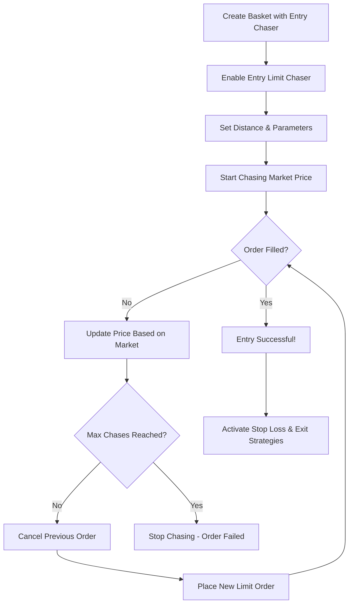

# 🚀 Entry Limit Chaser - Complete Implementation Guide

## 🎯 What is Entry Limit Chaser?

The **Entry Limit Chaser** is a sophisticated order execution strategy that **automatically adjusts your entry order price** to chase better fills while trying to enter a position. Instead of placing a static limit order, it dynamically follows the market price at a configured distance to get better entry prices.

## 🔑 Key Benefits

### ✅ **Better Entry Prices**
- Chase market price at a distance for better fills
- Avoid paying the spread on entry
- Get better risk/reward ratios

### ✅ **Automated Execution**
- No manual monitoring required
- Automatic price updates every X seconds
- Smart Fill-or-Cancel (IOC) behavior

### ✅ **Risk Control**
- Maximum chase limits prevent runaway orders
- Configurable distance controls
- Timeout mechanisms for failed fills

## 📊 How It Works

### **Entry Limit Chaser Flow:**



## ⚙️ Configuration Options

### **Basic Settings**
```typescript
entryLimitChaser: {
  enabled: true,              // Enable/disable feature
  distance: 0.005,            // 0.5% distance from market
  distanceType: 'percentage', // 'percentage' or 'absolute'
  maxChases: 5,               // Maximum chase attempts
  updateInterval: 30,         // Update every 30 seconds
  fillOrCancel: true          // Use IOC orders
}
```

### **Distance Calculation**
For **BUY** orders (Long positions):
- Chases **BELOW** market price for better entry
- Example: Market = $95,000, Distance = 0.5% → Entry = $94,525

For **SELL** orders (Short positions):
- Chases **ABOVE** market price for better entry  
- Example: Market = $95,000, Distance = 0.5% → Entry = $95,475

## 🎮 User Interface

### **New Entry Chaser Section**
The UI now includes a dedicated section for Entry Limit Chasing:

```
┌─────────────────────────────────────────────────────────────┐
│  🚀 Entry Limit Chaser                Chase better entry prices│
├─────────────────────────────────────────────────────────────┤
│  ☑ Enabled                                                  │
│                                                             │
│  Distance: [0.5%] Type: [Percentage ▼] Max Chases: [5]     │
│  ☑ Fill or Cancel (IOC)  Update Interval: [30] seconds     │
│                                                             │
│  💡 Entry Chaser: Automatically adjusts your entry order    │
│     price to chase better fills. For LONG positions,       │
│     chases below market price by 0.5% distance.            │
└─────────────────────────────────────────────────────────────┘
```

## 🔧 Implementation Details

### **New Basket Status: `entry_chasing`**
```typescript
status: 'pending' | 'entry_chasing' | 'active' | 'completed' | 'cancelled' | 'error'
```

### **Enhanced Entry Order Configuration**
```typescript
entryOrder: {
  type: 'limit',
  quantity: 0.001,
  price: 95000,
  leverage: 10,
  // NEW: Entry limit chaser configuration
  limitChaser?: {
    enabled: boolean;
    distance: number;
    distanceType: 'percentage' | 'absolute';
    fillOrCancel: boolean;
    updateInterval: number;
    maxChases: number;
    chaseCount: number;
  }
}
```

### **Enhanced Active Orders Tracking**
```typescript
activeOrders: {
  entryOrderId?: string;
  entryLimitChaserOrderId?: string;  // NEW: Track entry chaser orders
  stopLossOrderId?: string;
  limitChaserOrderId?: string;       // For exit limit chaser
  takeProfitOrderIds: string[];
}
```

## 📈 Real-World Examples

### **Example 1: BTC Long Entry Chaser**
```javascript
const basketConfig = {
  name: 'BTC Long with Entry Chaser',
  symbol: 'BTC',
  side: 'buy',
  
  entryOrder: {
    type: 'limit',
    quantity: 0.001,
    price: 95000,        // Initial target price
    leverage: 10,
    
    // Entry chaser configuration
    limitChaser: {
      enabled: true,
      distance: 0.005,    // 0.5% below market
      distanceType: 'percentage',
      fillOrCancel: true, // IOC orders
      updateInterval: 30, // Update every 30 seconds
      maxChases: 5,       // Try 5 times
      chaseCount: 0
    }
  }
};
```

**Execution Scenario:**
1. **Market Price: $95,000** → Place limit buy at $94,525 (0.5% below)
2. **Market Rises to $95,500** → Cancel previous, place buy at $95,027
3. **Market Drops to $94,800** → Cancel previous, place buy at $94,326  
4. **Order Fills at $94,326** → Entry successful! Start stop loss monitoring

### **Example 2: ETH Short Entry Chaser**
```javascript
const basketConfig = {
  name: 'ETH Short with Entry Chaser',
  symbol: 'ETH',
  side: 'sell',
  
  entryOrder: {
    type: 'limit',
    quantity: 1.0,
    price: 2500,
    leverage: 5,
    
    limitChaser: {
      enabled: true,
      distance: 0.003,    // 0.3% above market
      distanceType: 'percentage',
      fillOrCancel: true,
      updateInterval: 20,
      maxChases: 8,
      chaseCount: 0
    }
  }
};
```

## 🚦 Execution States

### **State Transitions:**
1. **`pending`** → Basket created, waiting for execution
2. **`entry_chasing`** → Entry chaser active, hunting for fills  
3. **`active`** → Entry filled, position open, stop loss active
4. **`completed`** → All objectives achieved
5. **`cancelled`** → User cancelled or max chases reached

## 📊 Monitoring & Logs

### **Execution Log Examples:**
```
[12:34:56] Entry chaser started at $95,000
[12:35:26] Entry chaser updated to $94,525 (Chase 1/5): IOC
[12:35:57] Entry IOC order cancelled - continuing to chase
[12:36:27] Entry chaser updated to $95,027 (Chase 2/5): IOC
[12:36:32] Entry order filled via chaser: order_12345
[12:36:33] Position opened - activating stop loss monitoring
```

### **Real-time Status Display:**
```
🟡 BTC Long Entry Chaser
    Status: Entry Chasing | Chase: 3/5 | Current: $94,326
    Target: Better than $95,000 | Distance: 0.5% below market
    [View Log] [Modify] [Cancel]
```

## ⚠️ Important Considerations

### **Risk Management**
- **Max Chases Limit**: Prevents endless chasing in volatile markets
- **Distance Control**: Don't chase too aggressively  
- **Market Conditions**: Works best in trending/directional markets
- **Liquidity**: Ensure sufficient liquidity at target prices

### **Best Practices**
- **Start Small**: Test with small position sizes first
- **Monitor Performance**: Track chase success rates
- **Adjust Distance**: Fine-tune based on market volatility
- **Set Realistic Expectations**: Not every chase will succeed

### **When NOT to Use Entry Chaser**
- ❌ During high volatility/news events
- ❌ In low liquidity markets
- ❌ For very large position sizes
- ❌ When immediate execution is critical

## 🎯 Success Metrics

### **Key Performance Indicators:**
- **Chase Success Rate**: % of successful entry fills
- **Average Entry Improvement**: Better price vs. initial target
- **Time to Fill**: Average time from start to successful entry
- **Max Chases Usage**: How often hitting maximum attempts

### **Example Success Story:**
```
📊 Entry Chaser Performance (Last 30 Days)
✅ Success Rate: 78% (23/30 attempts)
💰 Average Entry Improvement: 0.32%
⏱️ Average Time to Fill: 2.4 minutes
🎯 Max Chases Hit: 3/30 attempts (10%)
```

## 🚀 Getting Started

### **Step 1: Enable Entry Chaser**
1. Create a new Basket Order
2. Set Order Type to "Limit" 
3. Check "Entry Limit Chaser" checkbox
4. Configure distance and parameters

### **Step 2: Configure Parameters**
```
Distance: 0.5% (start conservative)
Max Chases: 5 (reasonable limit)
Update Interval: 30 seconds (not too aggressive)
Fill or Cancel: ✅ Enabled (IOC behavior)
```

### **Step 3: Monitor Execution**
- Watch the execution logs for chase updates
- Monitor market conditions during chasing
- Adjust parameters based on performance

## 🔮 Advanced Strategies

### **Scalping Strategy**
```javascript
// Ultra-fast entry chasing for scalping
limitChaser: {
  distance: 0.001,      // 0.1% very tight
  updateInterval: 10,   // Very frequent updates
  maxChases: 15,        // More attempts
  fillOrCancel: true    // IOC for speed
}
```

### **Swing Trading Strategy**  
```javascript
// Patient entry chasing for swing trades
limitChaser: {
  distance: 0.01,       // 1% wider distance
  updateInterval: 60,   // Less frequent updates
  maxChases: 3,         // Fewer attempts
  fillOrCancel: false   // GTC orders
}
```

## 🎉 Benefits Summary

✅ **Better Entry Prices**: Improve your risk/reward ratios  
✅ **Automated Execution**: No manual monitoring required  
✅ **Risk Controlled**: Maximum chase limits and timeouts  
✅ **Flexible Configuration**: Adapt to any trading style  
✅ **Complete Integration**: Works with stop loss and exit strategies  
✅ **Professional Grade**: Institutional-quality order management  

---

## 🏁 Conclusion

The **Entry Limit Chaser** transforms static limit orders into intelligent, adaptive entry strategies. By automatically chasing better prices while respecting risk parameters, it helps traders achieve superior entry prices without constant manual monitoring.

**This feature bridges the gap between manual trading and algorithmic execution, giving retail traders access to professional-grade order management tools!** 🚀
